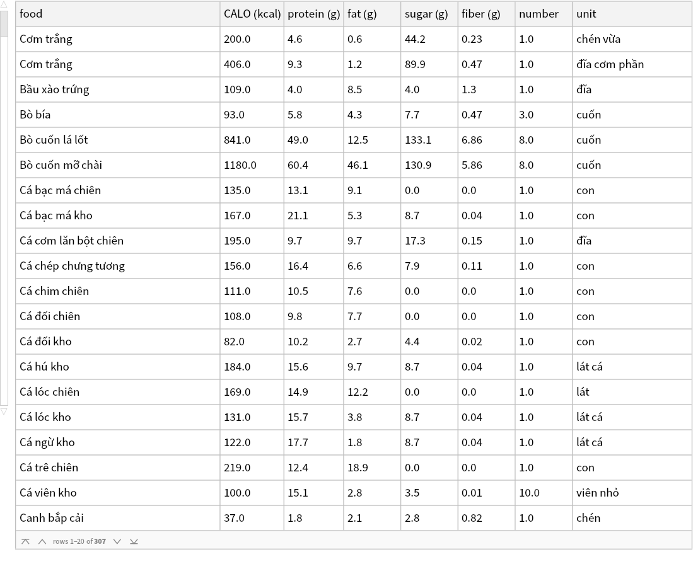
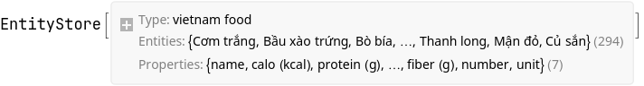
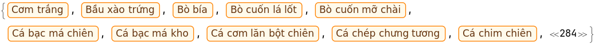

```mathematica
SetDirectory["/home/vermin/nhannht-projects/cochinchina-food"]

(*"/home/vermin/nhannht-projects/cochinchina-food"*)
```

```mathematica
data = SemanticImport["/home/vermin/nhannht-projects/cochinchina-food/vietnamesenutrition_clean.csv"]
```



```mathematica
convertFoodToEntity[row_Association] := Module[{name, calo, protein, fat, sugar, fiber, number, unit}, 
   name = row["food"]; 
   calo = row["CALO (kcal)"]; protein = row["protein (g)"]; sugar = row["sugar (g)"]; 
   fiber = row["fiber (g)"]; number = row["number"]; unit = row["unit"]; 
   name -> <|
     "name" -> name, 
     "calo (kcal)" -> calo, 
     "protein (g)" -> protein, 
     "sugar (g)" -> sugar, 
     "fiber (g)" -> fiber, 
     "number" -> number, 
     "unit" -> unit 
    |> 
  ] 
```

```mathematica
entities = (Association@(convertFoodToEntity[#] & /@ (data // Normal) ));
```

```mathematica
store = EntityStore["vietnam food" -> <|
     "Entities" -> entities 
    |>]
```



```mathematica
EntityRegister[store]

(*{"vietnam food"}*)
```

```mathematica
EntityList["vietnam food"] // Shallow
```



```mathematica

```